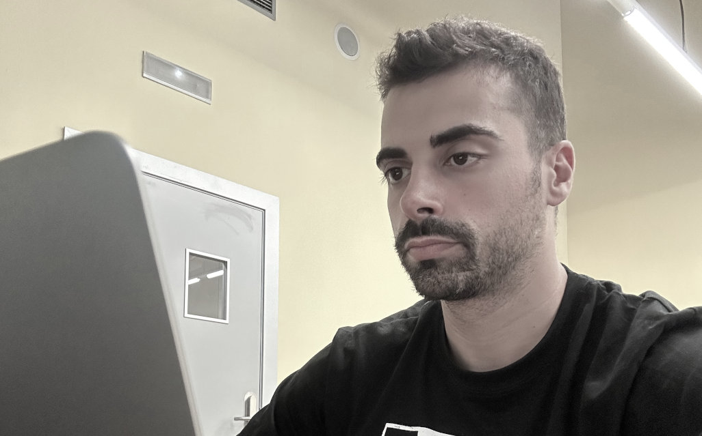

## Long story short

Learn by doing approach since I was a toddler

I've always loved to tinker. Even as a toddler, I could spend hours playing with cables and exploring gadgets. They've always fascinated me! I remember a funny story from when I was 12: my dad brought home a broken computer, and I immediately wanted to repair it. I opened it up and started examining and touching the components, but unfortunately, I changed the power supply voltage input and caused a small explosion after plugging it in. That moment made me realize how much I wanted to understand what was happening inside those mysterious metal boxes.

After some years in the university, I realized that learning was not enough. I wanted hands-on experience, so I started working on different projects, ranging from doing robotic training for school students to volunteering to help with networking configuration and practicalities on Campus Party Europe in Berlin.

I also love to step out of my comfort zone; for example, back in 2022, I faced one of my biggest fears: doing my first public talk with hundreds of people. After that, I realized I enjoyed that fulfilling and empowered feeling. That was one of those life-changing moments, so I now embrace upcoming challenges.

## Main skills

Technical skills and soft skills balance is a must

###  Technical skills

Extensive experience with on-premise and public cloud platforms, particularly AWS. Proficient in various tools and services, covering testing, deployment, and active monitoring. Security is always at the forefront of my mind.

###  Soft skills

Strong leadership, effective communication, thriving in challenging situations, and good problem-solving abilities, all seasoned with empathy and a positive working environment (even if people sometimes groan at my dad's jokes :smiling_face_with_tear:).

## Resume

It's cool to share my resume so that you can learn more about my background and interests, but I don't want to write it down here with a long, detailed list. I don't want to be that boring :grin:. So, I'll share some key details about my work experience, certifications, and education. Therefore, if you're interested in knowing more, you can always check my [profile in LinkedIn](https://www.linkedin.com/in/adriantunez/) or ask me anything you might have using the [contact page]({}).

### Work experience

|Company|Job Title|Period|Keywords|
|---|---|---|---|
|Clovr Labs|Platform Engineer|2025 - present|{{
}}Kubernetes, Helm, ArgoCD, GitHub, AWS, Terraform, Ansible, Grafana/Datadog, Go, Blockchain, Lightning network, Security{{
}}
|Polar Squad|DevOps Consultant|2023 - 2025|{{
}}Kubernetes, Helm, ArgoCD, GitHub, AWS/Onprem, AWS CDK/Terraform, Grafana, NodeJS, Python{{
}}
|Freelance Consultant|DevOps & SRE Consultant|2020 - 2022|{{
}}AWS, Github/Gitlab, Kubernetes, Terraform, NodeJs/PHP/Python{{
}}|
|Inbenta|DevOps & Security Engineer|2017 - 2022|{{
}}AWS, Gitlab, Terraform, Memcached/Redis, NodeJS, PHP, Python{{
}}
|Expert Ymaging|Systems Engineer Software Developer|2015 - 2017|{{
}}Onprem, Proxmox, Fortinet, Cisco, Github, C/C++, Python{{
}}
|Universitat Autònoma de Barcelona|Research Technician System Administrator|2013 - 2015|{{
}}Github, Redis, C/C++, Python{{
}}
|Finixer|System Administrator Java Backend Developer|2013 - 2013|{{
}}Jenkins, Mercurial/Bitbucket, Tomcat, Redis, MySQL, Groovy, Java{{
}}

### Certifications

Certifications are just the beginning, but they're a strong foundation in addition to the production experience. They also showcase my commitment to continuous learning and expertise. There might be more to come in this field, so stay tuned!

|Certificate|Institution|Date|
|---|---|---|---|
|AWS Certified Solutions Architect – Associate|Amazon Web Services Training and Certification|2025|
|CKA: Certified Kubernetes Administrator|The Linux Foundation|2023|
|CKAD: Certified Kubernetes Application Developer|The Linux Foundation|2023|

### Education

|Degree|School|Grade|Years|
|---|---|---|---|
|MISTIC: Master of Engineering (MEng) - Security of ICT|Universitat Oberta de Catalunya|9.42 / 10|2014 - 2015|
|Engineering Degree in Computer Science|Universitat Autònoma de Barcelona|7.91 / 10|2009 - 2014|

My resume (.pdf)
