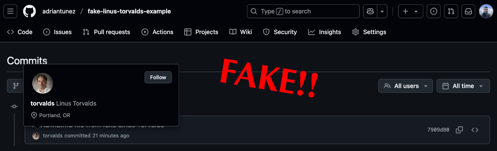

## Introduction

Signed commits are quite unknown to the vast majority of people, but they serve a very specific and important purpose: proving authorship cryptographically. Signed commits allow others to verify that you are who you say you are.

It's incredibly simple to fake a commit, impersonating someone else. Like for instance Linus Torvalds. You just need to configure your repository with the proper commit information. Note the information is publicly available simply by inspecting any Linus Git commit:


git config user.email torvalds@linux-foundation.org


Therefore, after committing and pushing to your git repository... voilà!

And this is not only an attack vector for public repositories, but also for private ones, where someone could impersonate a high-ranking member of the company... How to fix this? Keep reading!

## The gap between Git and GitHub

At this point, you might be wondering:

> If we already have users in GitHub, why can't we just trust Git commits from them?

It's a great question. The core issue lies in how Git (the tool) stores commit metadata versus how GitHub (the platform) interprets it. Let's first clarify two terms:

- **Authentication**: Proving who you are. This happens when you log in to GitHub. You prove to the platform that you own that account.

- **Authorization**: What you're allowed to do once authenticated. For example, you might be authorized to push to a repository or create a branch.

Here's the key point: authentication and authorization happen on GitHub's side, but commit metadata (e.g.: email) is embedded directly in Git by the client. GitHub doesn't validate Git metadata against your identity, it directly displays what's written in the commit.

## Commit signing

### How it works

As we have seen, without commit signing, anyone with push access to the repository could easily impersonate you, i.e.: set your email in a Git commit, and GitHub would happily show the fake commit author.

When you make a signed commit, Git uses your private key to generate a cryptographic signature tied to the commit's contents. In this process, only you use your private key to create the signature. Everyone else, including GitHub, can then use the public key (if provided) to verify that the signature is valid. As a result, anyone can verify that you are who you claim to be.

### Signing methods

At the moment, there are two commit signing methods allowed by GitHub based on the type of the key used: GPG and SSH.

#### GPG keys

GPG keys stands for GNU Privacy Guard. Those keys are a widely adopted standard for signing and encrypting data. They are commonly used to verify commit authorship among other applications like signing emails.

**Creating a GPG key for signing commits**

1. Verify `gnupg` tool is already installed by `gpg --version`, install it otherwise:
   
   brew install gnupg # MacOs
   sudo apt update && sudo apt install gnupg # Debian/Ubuntu
   

1. Generate a GPG key:
   
   gpg --full-generate-key

# select: (9) ECC (sign and encrypt) _default_

# select: (1) Curve 25519 _default_

# select: 0 = key does not expire



1. Set a name, an email, and a comment:
   
   Real name: Adri Antunez
   Email address: 1443326+adriantunez@users.noreply.github.com
   Comment: Main GPG
   

1. Set a passphrase for extra security (optional).

1. List your keys and copy the key ID:
   
   gpg --list-keys

# key ID: 1B085B03AE15FC601C9244CF4597EA93EB5F9B02



1. Get the public key value and copy it:
   
   gpg --armor --export 1B085B03AE15FC601C9244CF4597EA93EB5F9B02
   
   Go into GitHub at `your profile` → `Settings` → `SSH and GPG keys` → `New GPG key`: - Define a `Title`. - Paste the contents into the `Key` field.

#### SSH keys

SSH stands for Secure Shell. SSH keys are primarily used for secure authentication and remote access, but GitHub also allows them to be used for signing Git commits.

1. Verify `openssh` tool is already installed by `ssh -V`, install it otherwise:
   
   brew install openssh # MacOs
   sudo apt update && sudo apt install openssh-client # Debian/Ubuntu
   

1. Generate a SSH key (if you don't have one):
   
   ssh-keygen -t ed25519 -C "1443326+adriantunez@users.noreply.github.com"

# Warning: Ensure you're not overriding existing keys!



1. Set a passphrase for extra security (optional).

1. Get the public key value and copy it:
   

# Assuming default location and default key name...

cat ~/.ssh/id_ed25519.pub

Go into GitHub at `your profile` → `Settings` → `SSH and GPG keys` → `New SSH key`: - Define a `Title`. - Define the key type as `Signing Key`. - Paste the contents into the `Key` field.

### Sign commits given a key type

Once you have your GPG or SSH key in place, you can start signing commits. I tend to use `.gitconfig` file for these type of configurations, it's cleaner, safer and faster. 

Example using GPG keys:


# ~/.gitconfig

[user]

# ... other non-related config

email = "1443326+adriantunez@users.noreply.github.com" # ensure the email matches your GitHub email account
signingkey = 1B085B03AE15FC601C9244CF4597EA93EB5F9B02 # your GPG key id
[gpg]
format = openpgp
[commit]
gpgsign = true # Automatically sign all commits (no need for: git commit -S ...)
[tag]
gpgsign = true # Automatically sign all tags (no need for: git tag -s ...)


Example using SSH keys:


# ~/.gitconfig

[user]

# ... other non-related config

email = "1443326+adriantunez@users.noreply.github.com" # ensure the email matches your GitHub email account
signingkey ~/.ssh/id_ed25519.pub # your SSH key path
[gpg]
format = ssh
[commit]
gpgsign = true # Automatically sign all commits (no need for: git commit -S ...)
[tag]
gpgsign = true # Automatically sign all tags (no need for: git tag -s ...)


To get more details on how to configure the `.gitconfig` file, as well as my approach to using different configuration files for different purposes on top of other useful Git settings, check out the [ Git dynamic authors]({}) blog post.


You can check the current value into project's directory with: `git config user.email`, `git config gpg.format`, etc.


### My personal preference

I prefer signing with GPG because it's the defacto standard (widely adopted), more mature and can be easily identified also with git commands. In addition, we could also use the same GPG key for other signatures, for example to sign emails. But both or them (GPG and SSH) does the job quite well, so it's up to you which one to embrace.

## Verified commits on GitHub

We've been discussing already quite a lot about signed commits in Git and GitHub's verified commits. Let's see them in action.

### The verified badge

GitHub shows next to each commit a badge, this badge can have the following status[^1]:

- Verified: The commit is signed, the signature was successfully verified, and the committer is who claims to be.
- Partially verified: The commit is signed, and the signature was successfully verified, but the commit has an author who: a) is not the committer and b) has enabled vigilant mode. In this case, the commit signature doesn't guarantee the consent of the author, so the commit is only partially verified.
- Unverified: The commit cannot be reliably attributed to the author. Something is not working as expected. There is a high risk of impersonation or tampering.
- Empty: This means the commit has not been signed at all. If vigilant mode[^1] is enabled, own unsigned commits will be marked as Unverified. But bear in mind that other's unsigned commits **won't** be marked as Unverified in some cases.

### Verified badge use cases

In order to see and understand GitHub verified badge in action, I've defined different use cases that will be inspected and explained carefully. In case you're curious, you can check the commit list from the [ Fake Linus Torvalds example ](https://github.com/adriantunez/fake-linus-torvalds-example/commits/main/) repo.

There are several use cases here, let's go through all of them:

1. **Impersonation: wrong signature**  
   When using someone else's email, but the commit is signed with a mismatched key, i.e.: not their public key on GitHub.  
   Badge: Unverified

1. **Impersonation: unsigned commit**  
   When using someone else’s email, but the commit is not signed at all.  
   No badge.  
   _⚠️ This can be confusing._

1. **Own email: correctly signed (name mismatch)**  
   Using your own email with a commit signed by the correct key, and the author name mismatches.  
   Badge: Verified.  
   _Note: GitHub ignored the fake name for verification._

1. **Own email: unsigned commit**  
   Using your own email without signing the commit.  
   Badge: Unverified  
   _Note: Badge is only shown in <cite>Vigilant Mode[^1]</cite>._

1. **Own email: wrong signature**  
   Using your own email, but with a signature that does not match your registered key.  
   Badge: Unverified.

1. **Own email: correctly signed (name match)**
   Using your own email with a valid signature from the correct key, and the author name matches.
   Using your own email, signing the commit with the correct key.  
   Badge: Verified.  
   _Note: At the end, this use case is the same as in 4, eventhough the name is correct here._


There are use cases where someone is impersonated but GitHub doesn't show any badge. This is shown in use case number 2, where no Git commit is signed and we're using someone's else valid email. To solve this, we can enforce commit signing.


_Note: The examples shown here uses GPG signing, but from GitHub's perspective the behaviour would be the same if SSH signing were used instead._

### Enforcing commit signing

GitHub badges can be really informative if we're proactive on checking commit's real authorship. Although, there are two big issues with this approach:

- Manual inspection is neither secure nor realistic.
- In some cases, no badge is displayed at all (see [verified badge use cases: #2]({})).

In order to solve these limitations, GitHub provides a mechanism to enforce that every commit needs to be signed and valid. This automates the verification process ensuring only trusted commits are accepted:

To enforce commit signing, we can create a new ruleset by:

1. Go to your `GitHub's repository` → `settings` → `Rules` → `Rulesets` → `New ruleset`.
1. Choose `New branch ruleset` or `New tag ruleset`, depending on whether you want to protect.
1. In the ruleset configuration, enable the `Require signed commits` option:
   
1. Configure the rest of the rules as needed. For example, apply them to all branches or only to selected ones.

Once enabled, GitHub will reject any unsigned or invalid commits:

.")

## Conclusions

In this article, we've covered what signed commits are, how they work, and why they matter for securing software. We also carefully reviewed how GitHub fixes the gap between Git (the tool) and GitHub (the platform) by verified commits and enforcement options.

This post is focused on GitHub, but similar verification mechanisms exist on other platforms such as GitLab and Bitbucket. Regardless of where your code lives, enabling commit signing and verification is a powerful step towards protecting your projects from impersonation.

By the way, in case you’re curious, I’ve published the GitHub repository with shown impersonation tests in the [ Fake Linus Torvalds example ](https://github.com/adriantunez/fake-linus-torvalds-example) repo. Feel free to take a look!

[^1]: If vigilant mode is enabled, any commit attributed to your account but not signed with your GPG or S/MIME key will be shown as Unverified. [+info](https://docs.github.com/en/authentication/managing-commit-signature-verification/displaying-verification-statuses-for-all-of-your-commits).
